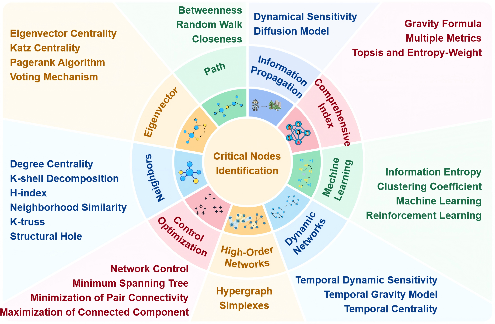

# Awesome-Critical-Nodes

## Critical Nodes Identification in Complex Networks: A Survey

Welcome to `Awesome-Critical-Nodes` GitHub repository! This repository hosts the introduction, papers of **Critical-Nodes** .

**Abstract**: Complex networks have become essential tools for understanding diverse phenomena in social systems, traffic systems, biomolecular systems, and financial systems. Identifying critical nodes is a central theme in contemporary research, serving as a vital bridge between theoretical foundations and practical applications. Nevertheless, the intrinsic complexity and structural heterogeneity characterizing real-world networks, with particular emphasis on dynamic and higher-order networks, present substantial obstacles to the development of universal frameworks for critical node identification. This paper provides a comprehensive review of critical node identification techniques, categorizing them into seven main classes: centrality, critical nodes deletion problem, influence maximization, network control, artificial intelligence, higher-order and dynamic methods. Our review bridges the gaps in existing surveys by systematically classifying methods based on their methodological foundations and practical implications, and by highlighting their strengths, limitations, and applicability across different network types. 
Our work enhances the understanding of critical node research by identifying key challenges, such as algorithmic universality, real-time evaluation in dynamic networks, analysis of higher-order structures, and computational efficiency in large-scale networks. The structured synthesis consolidates current progress and highlights open questions, particularly in modeling temporal dynamics, advancing efficient algorithms, integrating machine learning approaches, and developing scalable and interpretable metrics for complex systems.

