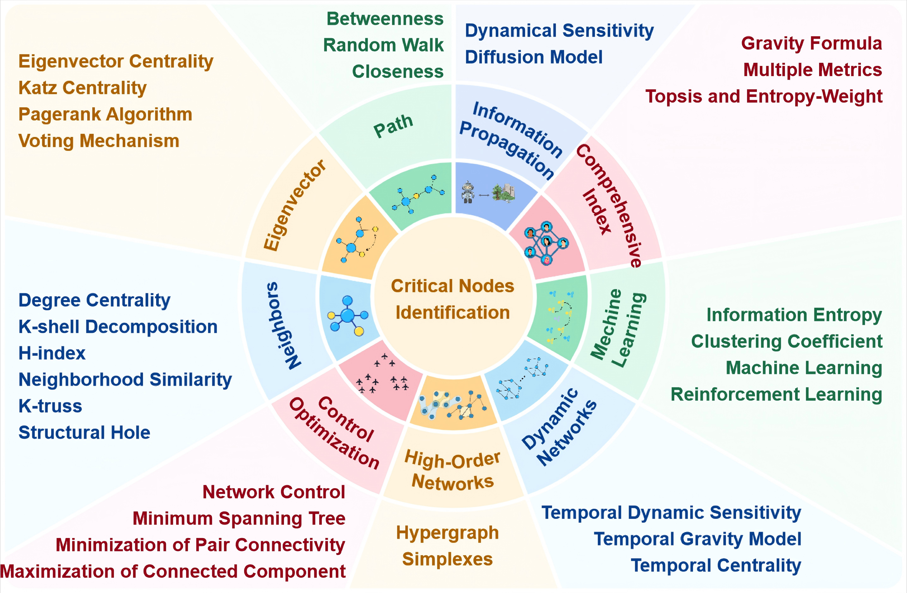

# Awesome-Critical-Nodes

## Critical Nodes Identification in Complex Networks: A Survey

Welcome to `Awesome-Critical-Nodes` GitHub repository! This repository hosts the introduction, papers of **Critical-Nodes** .

**Abstract**: Complex networks have become essential tools for understanding diverse phenomena in social systems, traffic systems, biomolecular systems, and financial systems. Identifying critical nodes is a central theme in contemporary research, serving as a vital bridge between theoretical foundations and practical applications. Nevertheless, the intrinsic complexity and structural heterogeneity characterizing real-world networks, with particular emphasis on dynamic and higher-order networks, present substantial obstacles to the development of universal frameworks for critical node identification. This paper provides a comprehensive review of critical node identification techniques, categorizing them into seven main classes: centrality, critical nodes deletion problem, influence maximization, network control, artificial intelligence, higher-order and dynamic methods. Our review bridges the gaps in existing surveys by systematically classifying methods based on their methodological foundations and practical implications, and by highlighting their strengths, limitations, and applicability across different network types. 
Our work enhances the understanding of critical node research by identifying key challenges, such as algorithmic universality, real-time evaluation in dynamic networks, analysis of higher-order structures, and computational efficiency in large-scale networks. The structured synthesis consolidates current progress and highlights open questions, particularly in modeling temporal dynamics, advancing efficient algorithms, integrating machine learning approaches, and developing scalable and interpretable metrics for complex systems.


<div align="center">

**[<a href="https://arxiv.org/abs/2507.06164">Paper Page</a>]**
**[<a href="https://mp.weixin.qq.com/s/a2vSxOfPIuFAe1v-YWMh_A">中文解读1</a>]**
**[<a href="https://mp.weixin.qq.com/s/vL-FXwYPN7d_bXblSec8Nw">中文解读2</a>]**
</div>


<p align="center">

</p>


Enjoy it Below:

- [Awesome-Critical-Nodes](#awesome-critical-nodes)
  - [Critical Nodes Identification in Complex Networks: A Survey](#critical-nodes-identification-in-complex-networks-a-survey)
    - [1. Neighbors-Based Ranking Methods](#1-neighbors-based-ranking-methods)
      - [1.1 Degree centrality](#11-degree-centrality)
      - [1.2 K-shell decomposition](#12-k-shell-decomposition)
      - [1.3 H-index](#13-h-index)
      - [1.4 K-truss](#14-k-truss)
      - [1.5 Structural hole](#15-structural-hole)
      - [1.6 Neighborhood similarity](#16-neighborhood-similarity)
    - [2. Eigenvector-based Ranking Methods](#2-eigenvector-based-ranking-methods)
      - [2.1 Eigenvector centrality](#21-eigenvector-centrality)
      - [2.2 Katz centrality](#22-katz-centrality)
      - [2.3 PageRank algorithm](#23-pagerank-algorithm)
      - [2.4 Voting mechanism](#24-voting-mechanism)
    - [3. Path-Based Ranking Methods](#3-path-based-ranking-methods)
      - [3.1 Betweenness centrality](#31-betweenness-centrality)
      - [3.2 Closeness centrality](#32-closeness-centrality)
      - [3.3 Random walk](#33-random-walk)
    - [4. Control-optimization based Ranking Methods](#4-control-optimization-based-ranking-methods)
      - [4.1 Network control](#41-network-control)
      - [4.2 Maximization of connected Component optimization](#42-maximization-of-connected-component-optimization)
      - [4.3 Minimization of pair Connectivity optimization](#43-minimization-of-pair-connectivity-optimization)
      - [4.4 Minimum spanning tree](#44-minimum-spanning-tree)
    - [5. Machine learning-based Ranking Methods](#5-machine-learning-based-ranking-methods)
      - [5.1 Information entropy](#51-information-entropy)
      - [5.2 Clustering coefficient](#52-clustering-coefficient)
      - [5.3 Graph conventional network](#53-graph-conventional-network)
      - [5.4 Graph embeddings](#54-graph-embeddings)
      - [5.5 Graph attention network](#55-graph-attention-network)
      - [5.6 Graph contrast learning](#56-graph-contrast-learning)
      - [5.7 Graph neural networks](#57-graph-neural-networks)
      - [5.7 Reinforcement learning](#57-reinforcement-learning)
    - [6. Comprehensive index-based Ranking Methods](#6-comprehensive-index-based-ranking-methods)
      - [6.1 Gravity formula](#61-gravity-formula)
      - [6.2 Multiple metrics](#62-multiple-metrics)
      - [6.3 Topsis and entropy-weight multiple metrics](#63-topsis-and-entropy-weight-multiple-metrics)
    - [7.Information propagation method](#7information-propagation-method)
      - [7.1. Diffusion model](#71-diffusion-model)
      - [7.2 Dynamical sensitivity](#72-dynamical-sensitivity)
    - [8. Higher-order Networks Based Ranking Methods](#8-higher-order-networks-based-ranking-methods)
    - [9 Dynamic Networks Based Ranking methods](#9-dynamic-networks-based-ranking-methods)
  - [Contributions](#contributions)
    - [Contribute in 3 Steps](#contribute-in-3-steps)
    - [Guidelines](#guidelines)


### 1. Neighbors-Based Ranking Methods

#### 1.1 Degree centrality

- Bavelas, A. A mathematical model for group structures(https://meridian.allenpress.com/human-organization/article/7/3/16/72796). Hum. Organ. 1948, 7, 16-30.

- Nieminen, J. On the centrality in a graph(https://onlinelibrary.wiley.com/doi/10.1111/j.1467-9450.1974.tb00598.x). Scand. J. Psychol. 1974, 15, 332-36.

 
- Chen, D.; Lü, L.; Shang, M. S.; Zhang, Y. C.; Zhou, T. Identifying influential nodes in complex networks(https://doi.org/10.1016/j.physa.2011.09.017). Phys. A. 2012, 391, 1777-87.

- Ma, Y.; Cao, Z.; Qi, X. Quasi-Laplacian centrality: a new vertex centrality measurement based on Quasi-Laplacian energy of networks(https://doi.org/10.1016/j.physa.2019.121130). Phys. A. 2019, 527, 121130.

- Zhu, X.; Hao, R. Identifying influential nodes in social networks via improved Laplacian centrality(https://doi.org/10.1016/j.chaos.2024.115675). Chaos. Soliton. Fract. 2024, 189, 115675.


#### 1.2 K-shell decomposition
- Kitsak, M.; Gallos, L. K.; Havlin, S.; et al. Identification of influential spreaders in complex networks(https://www.nature.com/articles/nphys1746). Nat. Phys. 2010, 6, 888-93.

- Zeng, A.; Zhang, C. J. Ranking spreaders by decomposing complex networks(https://doi.org/10.1016/j.physleta.2013.02.039). Phys. Lett. A. 2013, 377, 1031-35.

- Li, C.; Wang, L.; Sun, S.; Xia, C. Identification of influential spreaders based on classified neighbors in real-world complex networks.(https://dx.doi.org/10.1016/j.amc.2017.10.001) Appl. Math. Comput. 2018, 320, 512-23.

- Liu, J. G.; Ren, Z. M.; Guo, Q. Ranking the spreading influence in complex networks.(https://doi.org/10.1016/j.physa.2013.04.032) Phys. A. 2013, 392, 4154-59.

- Zareie, A.; Sheikhahmadi, A. A hierarchical approach for influential node ranking in complex social networks. Expert.(https://doi.org/10.1016/j.eswa.2017.10.018) Syst. Appl. 2018, 93, 200-211.

- Ibnoulouafi, A.; El Haziti, M.; Cherifi, H. M-centrality: identifying key nodes based on global position and local degree variation.(https://iopscience.iop.org/article/10.1088/1742-5468/aace08) J. Stat. Mech. 2018, 2018, 073407.

- Liu, Y.; Tang, M.; Zhou, T.; Do, Y. Core-like groups result in invalidation of identifying super-spreader by k-shell decomposition.(https://doi.org/10.1038/srep09602) Sci. Rep. 2015, 5, 9602.

 
- Liu, Y.; Tang, M.; Zhou, T.; Do, Y. Improving the accuracy of the k-shell method by removing redundant links: from a perspective of spreading dynamics.(https://doi.org/10.1038/srep13172) Sci. Rep. 2015, 5, 13172.


#### 1.3 H-index
-  Lü, L.; Zhou, T.; Zhang, Q. M.; Stanley, H. E. The H-index of a network node and its relation to degree and coreness.(https://doi.org/10.1038/ncomms10168) Nat. Commun. 2016, 7, 10168.

 
- Liu, Q.; Zhu, Y. X.; Jia, Y.; et al. Leveraging local h-index to identify and rank influential spreaders in networks.(https://doi.org/10.1016/j.physa.2018.08.081) Phys. A. 2018, 512, 379-91.

- Gao, L.; Yu, S.; Li, M.; Shen, Z.; Gao, Z. Weighted h-index for identifying influential spreaders.(https://doi.org/10.3390/sym11101263) Symmetry 2019, 11, 1263.

- Zareie, A.; Sheikhahmadi, A. EHC: extended H-index centrality measure for identification of users' spreading influence in complex networks. (https://doi.org/10.3390/sym11101263)Phys. A. 2019, 514, 141-55.

#### 1.4 K-truss
- Cohen, J. Trusses: cohesive subgraphs for social network analysis.(https://www.researchgate.net/publication/242103824_Trusses_Cohesive_Subgraphs_for_Social_Network_Analysis) National Security Agency Technical Report; 2008.

- Malliaros, F. D.; Rossi, M. E. G.; Vazirgiannis, M. Locating influential nodes in complex networks.(https://doi.org/10.1038/srep19307)  Sci. Rep. 2016, 6, 19307.

#### 1.5 Structural hole
-  Yu, F.; Xia, X.; Li, W.; et al. Critical node identification for complex network based on a novel minimum connected dominating set.(https://doi.org/10.1007/s00500-016-2303-y)  Soft. Comput. 2017, 21, 5621-29.

- Yu, H.; Cao, X.; Liu, Z.; Li, Y. Identifying key nodes based on improved structural holes in complex networks.(https://doi.org/10.1016/j.physa.2017.05.028)  Phys. A. 2017, 486, 318-27.

- Xu, H.; Zhang, J.; Yang, J.; Lun, L. Identifying important nodes in complex networks based on multiattribute evaluation.(https://doi.org/10.1155/2018/8268436)  Math. Probl. Eng. 2018, 2018, 8268436.

- Liu, Y.; Wang, J.; He, H.; Huang, G.; Shi, W. Identifying important nodes affecting network security in complex networks.(https://doi.org/10.1177/1550147721999285)  Int. J. Distrib. Sens. Netw. 2021, 17, 1550147721999285.

- Zhao, Z.; Li, D.; Sun, Y.; Zhang, R.; Liu, J. Ranking influential spreaders based on both node k-shell and structural hole. Knowl.(https://doi.org/10.1016/j.knosys.2022.110163)Based. Syst. 2023, 260, 110163.

- Ma, J.; Kong, L.; Li, H. An effective edge-adding strategy for enhancing network traffic capacity.(http://dx.doi.org/10.1016/j.physa.2022.128321)  Phys. A. 2023, 609, 128321.


#### 1.6 Neighborhood similarity

- Wang, P.; Xu, B.; Wu, Y.; Zhou, X. Link prediction in social networks: the state-of-the-art.(http://dx.doi.org/10.48550/arXiv.1411.5118)  Sci. China. Inf. Sci. 2015, 1, 1-38.

- Lu, P.; Zhang, Z. Critical nodes identification in complex networks via similarity coefficient.(http://dx.doi.org/10.1142/s021798492150620x)  Mod. Phys. Lett. B. 2022, 36, 2150620.

- Ai, J.; He, T.; Su, Z. Identifying influential nodes in complex networks based on resource allocation similarity.(http://dx.doi.org/10.1016/j.physa.2023.129101)  Phys. A. 2023, 627, 129101.

- Rao, K. V.; Chowdary, C. R. CBIM: community-based influence maximization in multilayer networks.(http://dx.doi.org/10.1016/j.ins.2022.07.103)  Inf. Sci. 2022, 609, 578-94.

- Tong, T.; Yuan, W.; Jalili, M.; Dong, Q.; Sun, J. A novel ranking approach for identifying crucial spreaders in complex networks based on Tanimoto Correlation.(http://dx.doi.org/10.1016/j.eswa.2024.124513)  Expert. Syst. Appl. 2024, 255, 124513.


### 2. Eigenvector-based Ranking Methods
#### 2.1 Eigenvector centrality

- Bonacich, P. Factoring and weighting approaches to clique identification.(http://dx.doi.org/10.1080/0022250X.1972.9989806)  J. Math. Sociol. 1971, 92, 1170-82.

-  Bonacich, P. Some unique properties of eigenvector centrality.(http://dx.doi.org/10.1016/j.socnet.2007.03.003)  Soc. Netw. 2007, 29, 555-64.

- Ilyas, M. U.; Radha, H. Identifying influential nodes in online social networks using principal component centrality.(http://dx.doi.org/10.1109/icc.2011.5963147)  In: 2011 IEEE International Conference on Communications. IEEE; 2011. pp. 1-5.

-  Estrada, E.; Rodríguez-Velázquez, J. A. Subgraph centrality in complex networks.(http://dx.doi.org/10.1103/PhysRevE.71.056103)  Phys. Rev. E. 2005, 71, 056103.

- Ahajjam, S.; El Haddad, M.; Badir, H. LeadersRank: towards a new approach for community detection in social networks.(http://dx.doi.org/10.1109/AICCSA.2015.7507215)  In: 2015 IEEE/ACS 12th International Conference of Computer Systems and Applications; 2015. pp. 1-8.

- Martin, T.; Zhang, X.; Newman, M. E. Localization and centrality in networks.(http://dx.doi.org/10.1103/PhysRevE.90.052808)  Phys. Rev. E. 2014, 90, 052808.

- Zhong, L.; Shang, M.; Chen, X.; Cai, S. M. Identifying the influential nodes via eigencentrality from the differences and similarities of structure.(http://dx.doi.org/10.1016/j.physa.2018.06.115)  Phys. A. 2018, 510, 77-82.


#### 2.2 Katz centrality
- Katz, L. A new status index derived from sociometric analysis.()  Psychometrika 1953, 18, 39-43.

- Zhang, Y.; Bao, Y.; Zhao, S.; Chen, J.; Tang, J. Identifying node importance by combining betweenness centrality and katz centrality.()  In: 2015 International Conference on Cloud Computing and Big Data; 2015. pp. 354-57.

#### 2.3 PageRank algorithm
-  Page, L.; Brin, S.; Motwani, R.; Winograd, T. [The pagerank citation ranking: bring order to the web.(http://ilpubs.stanford.edu:8090/422/)  Stanford University; 1998..

- Yang, Y.; Xie, G.; Xie, J. Mining important nodes in directed weighted complex networks. Discrete.(http://dx.doi.org/10.1155/2017/9741824) Dyn. Nat. Soc. 2017, 2017, 9741824.

-  Chinchi, H.; Yian, L.; Wenhao, C.; Minghan, F.; Shoude, L. Unsupervised ranking using graph structures and node attributes.(http://dx.doi.org/10.1145/3018661.3018668) In Proceedings of the tenth ACM International Conference on Web Search and Data Mining; 2017. pp. 771-79.

-  Sheng, J.; Zhu, J.; Wang, Y.; Wang, B.; Hou, Z. Identifying influential nodes of complex networks based on trust-value.(http://dx.doi.org/10.3390/a13110280) Algorithms 2020, 13, 280.

- Su, Q.; Chen, C.; Sun, Z.; Li, J. Identification of critical nodes for cascade faults of grids based on electrical PageRank.(http://dx.doi.org/10.1016/j.gloei.2022.01.006) Glob. Energy. Interconnect. 2021, 4, 587-95.

#### 2.4 Voting mechanism
- Lü, L.; Zhang, Y. C.; Yeung, C. H.; Zhou, T. Leaders in social networks, the delicious case.(http://dx.doi.org/10.1371/journal.pone.0021202) PLoS. One. 2011, 6, e21202.

 
-  Li, Q.; Zhou, T.; Lü, L.; Chen, D. Identifying influential spreaders by weighted LeaderRank.(http://dx.doi.org/10.1016/j.physa.2014.02.041) Phys. A. 2014, 404, 47-55.

-  Zhang, J.; Chen, D.; Dong, Q.; Zhao, Z. Identifying a set of influential spreaders in complex networks.(http://dx.doi.org/10.1038/srep27823) Sci. Rep. 2016, 6, 27823.

 
- Kumar, S.; Panda, B. S. Identifying influential nodes in social networks: neighborhood Coreness based voting approach.(http://dx.doi.org/10.1016/j.physa.2020.124215) Phys. A. 2020, 553, 124215.

- Sun, H.; Chen, D.; He, J.; Ch'ng, E. A voting approach to uncover multiple influential spreaders on weighted networks.(http://dx.doi.org/10.1016/j.physa.2019.01.067) Phys. A. 2019, 519, 303-12.

-  Li, Y.; Yang, X.; Zhang, X.; Xi, M.; Lai, X. An improved voterank algorithm to identifying a set of influential spreaders in complex networks.(http://dx.doi.org/10.3389/fphy.2022.955727) Front. Phys. 2022, 10, 955727.

- Liu, J.; Xiong, Q.; Shi, W.; Shi, X.; Wang, K. Evaluating the importance of nodes in complex networks.(http://dx.doi.org/10.1016/j.physa.2016.02.049) Phys. A. 2016, 452, 209-19.


### 3. Path-Based Ranking Methods
#### 3.1 Betweenness centrality
- Freeman, L. C. A set of measures of centrality based on betweenness.(http://dx.doi.org/10.2307/3033543) Sociometry 1977, 40, 35-41.

-  Hage, P.; Harary, F. Eccentricity and centrality in networks.(http://dx.doi.org/10.1016/0378-8733(94)00248-9) Soc. Netw. 1995, 17, 57-63.

- Boccaletti, S.; Latora, V.; Moreno, Y.; Chavez, M.; Hwang, D. U. Complex networks: structure and dynamics.(http://dx.doi.org/10.1016/j.physrep.2005.10.009) Phys. Rep. 2006, 424, 175-308.

-  Lü, Z.; Zhao, N.; Xiong, F.; Chen, N. A novel measure of identifying influential nodes in complex networks.(http://dx.doi.org/10.1016/j.physa.2019.02.046) Phys. A. 2019, 523, 488-97.

- Song, Z.; Duan, H.; Ge, Y.; Qiu, X. A novel measure of centrality based on betweenness.(http://dx.doi.org/10.1109/CAC.2015.7382491) In 2015 Chinese Automation Congress; 2015. pp. 174-78.

-  Ventresca, M.; Aleman, D. Efficiently identifying critical nodes in large complex networks. Comput.(http://dx.doi.org/10.1186/s40649-015-0010-y) Soc. Netw. 2015, 2, 1-16.

- Zhang, J.; Xu, X.; Li, P.; Zhang, K.; Small, M. Node importance for dynamical process on networks: a multiscale characterization.(http://dx.doi.org/10.1063/1.3553644) Chaos 2011, 21.

- Yang, D.; Sun, Y.; Zhou, B.; Gao, X.; Zhang, H. Critical nodes identification of complex power systems based on electric cactus structure.(http://dx.doi.org/10.1109/jsyst.2020.2967403) IEEE. Syst. J. 2020, 14, 4477-88.

-  Kianian, S.; Rostamnia, M. An efficient path-based approach for influence maximization in social networks.(http://dx.doi.org/10.1016/j.eswa.2020.114168) Expert. Syst. Appl. 2021, 167, 114168.

-  Xiao, Y.; Chen, Y.; Zhang, H.; et al. A new semi-local centrality for identifying influential nodes based on local average shortest path with extended neighborhood.(http://dx.doi.org/10.1007/s10462-024-10725-2) Artif. Intell. Rev. 2024, 57, 115.


#### 3.2 Closeness centrality
- Freeman, L. C. Centrality in social networks: Conceptual clarification. (http://dx.doi.org/10.1016/0378-8733(78)90021-7)Soc. Netw. 2002, 1, 238-63.

- Latora, V.; Marchiori, M. Efficient behavior of small-world networks.(http://dx.doi.org/10.1103/physrevlett.87.198701) Phys. Rev. Lett. 2001, 87, 198701.

 
-  Salavati, C.; Abdollahpouri, A.; Manbari, Z. Ranking nodes in complex networks based on local structure and improving closeness centrality.(http://dx.doi.org/10.1016/j.neucom.2018.04.086) Neurocomputing 2019, 336, 36-45.

-  Okamoto, K.; Chen, W.; Li, X. Ranking of closeness centrality for large-scale social networks.(http://dx.doi.org/10.1007/978-3-540-69311-6_21) In Proceedings of the 2nd Annual International Workshop on Frontiers in Algorithmics. Heidelberg: Springer-Verlag; 2008. p. 186-95.

- Sheng, J.; Dai, J.; Wang, B.; et al. Identifying influential nodes in complex networks based on global and local structure.(http://dx.doi.org/10.1016/j.physa.2019.123262) Phys. A. 2020, 541, 123262.


#### 3.3 Random walk
- Iannelli, F.; Mariani, M. S.; Sokolov, I. M. Influencers identification in complex networks through reaction-diffusion dynamics.(http://dx.doi.org/10.1103/physreve.98.062302) Phys. Rev. E. 2018, 98, 062302.

- Dong, J.; Ye, F.; Chen, W.; Wu, J. Identifying influential nodes in complex networks via semi-local centrality.(http://dx.doi.org/10.1109/ISCAS.2018.8351659) In 2018 IEEE International Symposium on Circuits and Systems; 2018. pp. 1-5.

- Kermarrec, A. M.; Le Merrer, E.; Sericola, B.; Trédan, G. Second order centrality: distributed assessment of nodes criticity in complex networks.(http://dx.doi.org/10.1016/j.comcom.2010.06.007) Comput. Commun. 2011, 34, 619-28.


 


### 4. Control-optimization based Ranking Methods


#### 4.1 Network control
- Li, X.; Wang, X. Controlling the spreading in small-world evolving networks: stability, oscillation, and topology.() IEEE. Trans. Autom. Control. 2006, 51, 534-40.

-  Ghosh, D.; Frasca, M.; Rizzo, A.; et al. The synchronized dynamics of time-varying networks. Phys. Rep. 2022, 949, 1-63.

-  D'Souza, R. M.; di Bernardo, M.; Liu, Y. Controlling complex networks with complex nodes. Nat. Rev. Phys. 2023, 5, 250-62.

-  Liu, Y.; Slotine, J. J.; Barabási, A. L. Controllability of complex networks. Nature 2011, 473, 167-73.

 
-  Ding, J.; Wen, C.; Li, G. Key node selection in minimum-cost control of complex networks. Phys. A. 2017, 486, 251-61.

-  Lu, J.; Liu, R.; Lou, J.; Liu, Y. Pinning stabilization of Boolean control networks via a minimum number of controllers. IEEE. Trans. Cybern. 2019, 51, 373-81.

 
- Zhu, S.; Cao, J.; Lin, L.; Lam, J.; Azuma, S. I. Toward stabilizable large-scale Boolean networks by controlling the minimal set of nodes. IEEE. Trans. Autom. Control. 2023, 69, 174-88.

- Yu, W.; DeLellis, P.; Chen, G.; Di Bernardo, M.; Kurths, J. Distributed adaptive control of synchronization in complex networks. IEEE. Trans. Autom. Control. 2012, 57, 2153-58.

-  Yu, W.; Chen, G.; Lu, J.; Kurths, J. Synchronization via pinning control on general complex networks. SIAM. J. Control. Optim. 2013, 51, 1395-416.

- Ding, J.; Tan, P.; Lu, Y. Z. Optimizing the controllability index of directed networks with the fixed number of control nodes. Neurocomputing 2016, 171, 1524-32.

- Amani, A. M.; Jalili, M.; Yu, X.; Stone, L. Finding the most influential nodes in pinning controllability of complex networks. IEEE. Trans. Circuits. Syst. Ⅱ. 2017, 64, 685-89.

- Amani, A. M.; Jalili, M.; Yu, X.; Stone, L. Controllability of complex networks: choosing the best driver set. Phys. Rev. E. 2018, 98, 030302.

- Liu, H.; Xu, X.; Lu, J. A.; Chen, G.; Zeng, Z. Optimizing pinning control of complex dynamical networks based on spectral properties of grounded Laplacian matrices. IEEE. Trans. Syst. Man. Cyber. Syst. 2018, 51, 786-96.

- Wang, W.; Ni, X.; Lai, Y.; Grebogi, C. Optimizing controllability of complex networks by minimum structural perturbations. Phys. Rev. E. 2012, 85, 026115.

-  Bof, N.; Baggio, G.; Zampieri, S. On the role of network centrality in the controllability of complex networks. IEEE. Trans. Control. Netw. Syst. 2016, 4, 643-53.

- Zhou, J.; Yu, X.; Lu, J. A. Node importance in controlled complex networks. IEEE. Trans. Circuits. Syst. Ⅱ. 2018, 66, 437-41.

-  Liu, H.; Wang, B.; Lu, J.; Li, Z. Node-set importance and optimization algorithm of nodes selection in complex networks based on pinning control. Acta. Phys. Sin. 2021, 70, 056401.

- Bomela, W.; Sebek, M.; Nagao, R.; et al. Finding influential nodes in networks using pinning control: centrality measures confirmed with electrochemical oscillators. Chaos 2023, 33, 093128.

 
-  Jiang, Q.; Zhou, J.; Li, B.; Liu, H.; Lu, J. A. Pinning synchronization of a complex network: nodes, edges and higher-order edges. Europhys. Lett. 2024, 147, 61001.

-  Sun, G. Q.; He, R.; Hou, L. F.; et al. Optimal control of spatial diseases spreading in networked reaction-diffusion systems. Phys. Rep. 2025, 1111, 1-64.

-  Zhang, H. T.; Chen, Z.; Mo, X. Effect of adding edges to consensus networks with directed acyclic graphs. IEEE. Trans. Autom. Control. 2017, 62, 4891-97.

-  Mo, X.; Chen, Z.; Zhang, H. T. Effects of adding a reverse edge across a stem in a directed acyclic graph. Automatica 2019, 103, 254-60.

-  Jiang, S.; Zhou, J.; Small, M.; Lu, J. A.; Zhang, Y. Searching for key cycles in a complex network. Phys. Rev. Lett. 2023, 130, 187402.

 
- Cao, H.; Zhang, H. T.; Xie, L. Synchronization acceleration of networked systems via edge addition to single-root weighted digraphs. IEEE. Trans. Autom. Control. 2024, 70, 1730-44.

- Zhang, H. T.; Cao, H.; Chen, Z. A necessary and sufficient condition of an interfering reverse edge for a directed acyclic graph. IEEE. Trans. Autom. Control. 2022, 67, 4885-91.

- Gao, S.; Zhang, S.; Chen, X. Effects of adding edges on the consensus convergence rate of weighted directed chain networks. IEEE. Trans. Autom. Control. 2025, 70, 4077-84.

#### 4.2 Maximization of connected Component optimization

- Aringhieri, R.; Grosso, A.; Hosteins, P.; Scatamacchia, R. A general evolutionary framework for different classes of critical node problems. Eng. Appl. Artif. Intell. 2016, 55, 128-45.

-  Alozie, G. U.; Arulselvan, A.; Akartunalı, K.; Pasiliao Jr, E. L. Efficient methods for the distance-based critical node detection problem in complex networks. Comput. Oper. Res. 2021, 131, 105254.

- Thulasiraman, K.; Swamy, M. N. S. Graphs:. theory. and. algorithms. 2011.

- Boginski, V.; Commander, C. W. Identifying. critical. nodes. in. protein-protein. interaction. networks;. 2008..

- Karygiannis, A.; Antonakakis, E.; Apostolopoulos, A. Detecting critical nodes for MANET intrusion detection systems. In Second International Workshop on Security, Privacy and Trust in Pervasive and Ubiquitous Computing; 2006. pp. 9-15.

- Arulselvan, A.; Commander, C. W.; Shylo, O.; Pardalos, P. M. Cardinality-constrained critical node detection problem. Performance Models and Risk Management in Communications Systems; 2011, pp. 79-91.

- Li, C.; Lin, S.; Shan, M. Finding influential mediators in social networks. In Proceedings of the 20th International Conference Companion on World Wide Web; 2011, pp. 75-6.

- Ventresca, M.; Harrison, K. R.; Ombuki-Berman, B. M. An experimental evaluation of multi-objective evolutionary algorithms for detecting critical nodes in complex networks. In European Conference on the Applications of Evolutionary Computation. Springer; 2015, pp. 164-76.

- Veremyev, A.; Boginski, V.; Pasiliao, E. L. Exact identification of critical nodes in sparse networks via new compact formulations. Optim. Lett. 2014, 8, 1245-59.

-  Ren, T.; Li, Z.; Qi, Y.; et al. Identifying vital nodes based on reverse greedy method. Sci. Rep. 2020, 10, 4826.

 
- Wang, Y.; Cong, G.; Song, G.; Xie, K. Community-based greedy algorithm for mining top-k influential nodes in mobile social networks. In Proceedings of the 16th ACM SIGKDD International Conference on Knowledge Discovery & Data Mining; 2010. pp. 1039-48.

-  Lam, C. Y.; Lin, J.; Sim, M. S.; Tai, K. Identifying vulnerabilities in critical infrastructures by network analysis. Int. J. Crit. Infrastruct. 2013, 9, 190-210.

- Ventresca, M.; Aleman, D. A fast greedy algorithm for the critical node detection problem. In: International Conference on Combinatorial Optimization and Applications. Springer; 2014. pp. 603-12.

-  Tang, J.; Zhang, R.; Wang, P.; et al. A discrete shuffled frog-leaping algorithm to identify influential nodes for influence maximization in social networks. Knowl. Based. Syst. 2020, 187, 104833.


#### 4.3 Minimization of pair Connectivity optimization
- Di Summa, M.; Grosso, A.; Locatelli, M. Branch and cut algorithms for detecting critical nodes in undirected graphs. Comput. Optim. Appl. 2012, 53, 649-80.

- Arulselvan, A.; Commander, C. W.; Elefteriadou, L.; Pardalos, P. M. Detecting critical nodes in sparse graphs. Comput. Oper. Res. 2009, 36, 2193-200.

- Shen, Y.; Dinh, T. N.; Thai, M. T. Adaptive algorithms for detecting critical links and nodes in dynamic networks. In: 2012 IEEE Military Communications Conference; 2012. pp. 1-6.

- Ventresca, M.; Aleman, D. A derandomized approximation algorithm for the critical node detection problem. Comput. Oper. Res. 2014, 43, 261-70.

-  Dinh, T. N.; Thai, M. T. Assessing attack vulnerability in networks with uncertainty. In: 2015 IEEE Conference on Computer Communications; 2015. pp. 2380-88.

-  Sarker, S.; Veremyev, A.; Boginski, V.; Singh, A. Critical nodes in river networks. Sci. Rep. 2019, 9, 11178.

 
-  Pullan, W. Heuristic identification of critical nodes in sparse real-world graphs. J. Heuristics. 2015, 21, 577-98.

-  Addis, B.; Aringhieri, R.; Grosso, A.; Hosteins, P. Hybrid constructive heuristics for the critical node problem. Ann. Oper. Res. 2016, 238, 637-49.

- Chen, W.; Jiang, M.; Jiang, C.; Zhang, J. Critical node detection problem for complex network in undirected weighted networks. Phys. A. 2020, 538, 122862.

-  Ventresca, M. Global search algorithms using a combinatorial unranking-based problem representation for the critical node detection problem. Comput. Oper. Res. 2012, 39, 2763-75.

- Shen, Y.; Nguyen, N. P.; Xuan, Y.; Thai, M. T. On the discovery of critical links and nodes for assessing network vulnerability. IEEE/ACM. Trans. Netw. 2012, 21, 963-73.

-  Ventresca, M.; Aleman, D. A region growing algorithm for detecting critical nodes. In: International Conference on Combinatorial Optimization and Applications. Springer; 2014. pp. 593-602.

- Yin, H.; Hou, J.; Gong, C. A mixed strength decomposition method for identifying critical nodes by decomposing weighted social networks. Europhys. Lett. 2023, 142, 61003.

-  Zhang, L.; Zhang, H.; Feng, X.; Yang, H.; Cheng, F. An evolutionary multitasking method for multi-objective critical node detection on interdependent networks. IEEE. Trans. Cognit. Commun. Netw. 2025, 11, 607-20.

-  Fortz, B.; Mycek, M.; Pióro, M.; Tomaszewski, A. Min-max optimization of node-targeted attacks in service networks. Networks 2024, 83, 256-88.

- Jiang, W.; Li, P.; Li, T.; Fan, T.; Zhang, C. Identifying vital edges based on the cycle structure in complex networks. Phys. Lett. A. 2025, 530, 130137.

- Kouam, W.; Hayel, Y.; Deugoué, G.; Kamhoua, C. A novel centrality measure for analyzing lateral movement in complex networks. Phys. A. 2025, 658, 130255.

- Zhou, M.; Liu, H.; Liao, H.; Liu, G.; Mao, R. Finding the key nodes to minimize the victims of the malicious information in complex network. Knowl. Based. Syst. 2024, 293, 111632.


#### 4.4 Minimum spanning tree
- Zhao, J.; Liu, X.; Guo, J. Evaluation method for node importance of communication network based on complex network analysis. In: Communications, Signal Processing, and Systems. Singapore: Springer; 2019.

-  Di Summa, M.; Grosso, A.; Locatelli, M. Complexity of the critical node problem over trees. Comput. Oper. Res. 2011, 38, 1766-74.

-  Hermelin, D.; Kaspi, M.; Komusiewicz, C.; Navon, B. Parameterized complexity of critical node cuts. Theor. Comput. Sci. 2016, 651, 62-75.

-  Addis, B.; Di Summa, M.; Grosso, A. Identifying critical nodes in undirected graphs: complexity results and polynomial algorithms for the case of bounded treewidth. Discrete. Appl. Math. 2013, 161, 2349-60.

-  Aringhieri, R.; Grosso, A.; Hosteins, P.; Scatamacchia, R. Local search metaheuristics for the critical node problem. Networks 2016, 67, 209-21.

145. Wang, H.; Shan, Z.; Ying, G.; et al. Evaluation method of node importance for power grid considering inflow and outflow power. J. Mod. Power. Syst. Clean. Energy. 2017, 5, 696-703.


### 5. Machine learning-based Ranking Methods


#### 5.1 Information entropy
146. Nikolaev, A. G.; Razib, R.; Kucheriya, A. On efficient use of entropy centrality for social network analysis and community detection. Soc. Netw. 2015, 40, 154-62.

147. Zareie, A.; Sheikhahmadi, A.; Jalili, M. Influential node ranking in social networks based on neighborhood diversity. Future. Gener. Comput. Syst. 2019, 94, 120-29.

148. Nitt, G. Using mapping entropy to identify node centrality in complex networks. Phys. A. 2016, 453, 290-97.

149. Fu, Y. H.; Huang, C. Y.; Sun, C. T. Identifying super-spreader nodes in complex networks. Math. Probl. Eng. 2015.

 
150. Guo, C.; Yang, L.; Chen, X.; et al. Influential nodes identification in complex networks via information entropy. Entropy 2020, 22, 242.

151. Xu, M.; Wu, J.; Liu, M.; et al. Discovery of critical nodes in road networks through mining from vehicle trajectories. IEEE. Trans. Intell. Trans. Syst. 2018, 20, 583-93.

-  Tulu, M. M.; Hou, R.; Younas, T. Identifying influential nodes based on community structure to speed up the dissemination of information in complex network. IEEE. Access. 2018, 6, 7390-401.

-  Ai, X. Node importance ranking of complex networks with entropy variation. Entropy 2017, 19, 303.

-  Wu, Y.; Dong, A.; Ren, Y.; Jiang, Q. Identify influential nodes in complex networks: a k-orders entropy-based method. Phys. A. 2023, 632, 129302.

-  Tong, T.; Dong, Q.; Sun, J.; Jiang, Y. Vital spreaders identification synthesizing cross entropy and information entropy with kshell method. Expert. Syst. Appl. 2023, 224, 119928.

- Li, Y.; Cai, W.; Li, Y.; Du, X. Key node ranking in complex networks: a novel entropy and mutual information-based approach. Entropy 2019, 22, 52.


#### 5.2 Clustering coefficient
-  Chen, D. B.; Gao, H.; Lü, L.; Zhou, T. Identifying influential nodes in large-scale directed networks: the role of clustering. PLoS. One. 2013, 8, e77455.

 
-  Gao, S.; Ma, J.; Chen, Z.; Wang, G.; Xing, C. Ranking the spreading ability of nodes in complex networks based on local structure. Phys. A. 2014, 403, 130-47.
- Yang, L.; Song, Y.; Jiang, G. P.; Xia, L. L. Identifying influential spreaders based on diffusion K-truss decomposition. Int. J. Mod. Phys. B. 2018, 32, 1850238.

- Zareie, A.; Sheikhahmadi, A.; Jalili, M.; Fasaei, M. S. K. Finding influential nodes in social networks based on neighborhood correlation coefficient. Knowl. Based. Syst. 2020, 194, 105580.
-  Dablander, F.; Hinne, M. Node centrality measures are a poor substitute for causal inference. Sci. Rep. 2019, 9, 6846.

 
- Liu, Y.; Song, A.; Shan, X.; Xue, Y.; Jin, J. Identifying critical nodes in power networks: a group-driven framework. Expert. Syst. Appl. 2022, 196, 116557.

-  Wang, B.; Zhang, J.; Dai, J.; Sheng, J. Influential nodes identification using network local structural properties. Sci. Rep. 2022, 12, 1833.

 
- Zhang, X.; Zhu, J.; Wang, Q.; Zhao, H. Identifying influential nodes in complex networks with community structure. Knowl. Based. Syst. 2013, 42, 74-84.


#### 5.3 Graph conventional network
-  Zhao, G.; Jia, P.; Zhou, A.; Zhang, B. InfGCN: identifying influential nodes in complex networks with graph convolutional networks. Neurocomputing 2020, 414, 18-26.

-  Kumar, S.; Mallik, A.; Khetarpal, A.; Panda, B. Influence maximization in social networks using graph embedding and graph neural network. Inf. Sci. 2022, 607, 1617-36.

-  Ribeiro, L. F.; Saverese, P. H.; Figueiredo, D. R. struc2vec: learning node representations from structural identity. In Proceedings of the 23rd ACM SIGKDD International Conference on Knowledge Discovery & Data Mining; 2017. pp. 385-94.

-  Zhang, M.; Wang, X.; Jin, L.; Song, M.; Li, Z. A new approach for evaluating node importance in complex networks via deep learning methods. Neurocomputing 2022, 497, 13-27.

-  Liu, C.; Cao, T.; Zhou, L. Learning to rank complex network node based on the self-supervised graph convolution model. Knowl. Based. Syst. 2022, 251, 109220.


#### 5.4 Graph embeddings
-  Wei, P.; Zhou, J.; Yan, B.; Zeng, Y. ENIMNR: enhanced node influence maximization through node representation in social networks. Chaos. Soliton. Fract. 2024, 186, 115192.

-  Keikha, M. M.; Rahgozar, M.; Asadpour, M.; Abdollahi, M. F. Influence maximization across heterogeneous interconnected networks based on deep learning. Expert. Syst. Appl. 2020, 140, 112905.

-  Bouyer, A.; Beni, H. A.; Oskouei, A. G.; et al. Maximizing influence in social networks using combined local features and deep learning-based node embedding. Big. Data. 2024.

-  Wu, Y.; Hu, Y.; Yin, S.; et al. A graph convolutional network model based on regular equivalence for identifying influential nodes in complex networks. Knowl. Based. Syst. 2024, 301, 112235.

- Ahmad, W.; Wang, B.; Chen, S. Learning to rank influential nodes in complex networks via convolutional neural networks. Appl. Intell. 2024, 54, 3260-78.

-  Rashid, Y.; Bhat, J. I. OlapGN: a multi-layered graph convolution network-based model for locating influential nodes in graph networks. Knowl. Based. Syst. 2024, 283, 111163.

- Xiong, Y.; Hu, Z.; Su, C.; Cai, S. M.; Zhou, T. Vital node identification in complex networks based on autoencoder and graph neural network. Appl. Soft. Comput. 2024, 163, 111895.

-  Yu, E.; Wang, Y.; Fu, Y.; Chen, D.; Xie, M. Identifying critical nodes in complex networks via graph convolutional networks. Knowl. Based. Syst. 2020, 198, 105893.


#### 5.5 Graph attention network
- Park, N.; Kan, A.; Dong, X. L.; Zhao, T.; Faloutsos, C. Estimating node importance in knowledge graphs using graph neural networks. In Proceedings of the 25th ACM SIGKDD International Conference on Knowledge Discovery & Data Mining; 2019. pp. 596-606.

-  Park, N.; Kan, A.; Dong, X. L.; Zhao, T.; Faloutsos, C. Multiimport: inferring node importance in a knowledge graph from multiple input signals. In Proceedings of the 26th ACM SIGKDD International Conference on Knowledge Discovery & Data Mining; 2020. pp. 503-12.

- Munikoti, S.; Das, L.; Natarajan, B. Scalable graph neural network-based framework for identifying critical nodes and links in complex networks. Neurocomputing 2022, 468, 211-21.

- Ge, K.; Han, Q. B. Node importance estimation for knowledge graphs based on multi-perspectives attention fusion mechanism. Int. J. Pattern. Recognit. Artif. Intell. 2024, 38, 2459017.

- Chen, X.; Lei, P. I.; Sheng, Y.; Liu, Y.; Gong, Z. Social influence learning for recommendation systems. In Proceedings of the 33rd ACM International Conference on Information and Knowledge Management; 2024. pp. 312-22.

- Liu, Z.; Qiu, H.; Guo, W.; Zhu, J.; Wang, Q. NIE-GAT: node importance evaluation method for inter-domain routing network based on graph attention network. J. Comput. Sci. 2022, 65, 101885.

-  Kou, J.; Jia, P.; Liu, J.; Dai, J.; Luo, H. Identify influential nodes in social networks with graph multi-head attention regression model. Neurocomputing 2023, 530, 23-36.

#### 5.6 Graph contrast learning
-  Liu, L.; Zeng, W.; Tan, Z.; Xiao, W.; Zhao, X. Node importance estimation with multiview contrastive representation learning. Int. J. Intell. Syst. 2023, 2023, 5917750.

-  Zhang, T.; Hou, C.; Jiang, R.; et al. Label informed contrastive pretraining for node importance estimation on knowledge graphs. IEEE. Trans. Neural. Networks. Learn. Syst. 2025, 36, 4462-76.

-  Shu, J.; Zou, Y.; Cui, H.; Liu, L. Node importance evaluation in heterogeneous network based on attention mechanism and graph contrastive learning. Neurocomputing 2025, 626, 129555.

#### 5.7 Graph neural networks
- Huang, C.; Fang, Y.; Lin, X.; et al. Estimating node importance values in heterogeneous information networks. In: 2022 IEEE 38th International Conference on Data Engineering; 2022. pp. 846-58.

- Chen, Y.; Fang, Y.; Wang, Q.; Cao, X.; King, I. Deep structural knowledge exploitation and synergy for estimating node importance value on heterogeneous information networks. In: Proceedings of the AAAI Conference on Artificial Intelligence; 2024. pp. 8302-10.

-  Lin, X.; Zhang, T.; Hou, C.; et al. Node importance estimation leveraging LLMs for semantic augmentation in knowledge graphs. arXiv 2024.

-  Zhao, X.; Yu, H.; Huang, R.; et al. A novel higher-order neural network framework based on motifs attention for identifying critical nodes. Phys. A. 2023, 629, 129194.

- Michos, I.; Neocleous, K.; Papadopoulou Lesta, V. Critical node detection in sparse graphs using hopfield neural networks. In Proceedings of the 13th Hellenic Conference on Artificial Intelligence; 2024. pp. 1-4.


#### 5.7 Reinforcement learning

-  Fan, C.; Zeng, L.; Sun, Y.; Liu, Y. Finding key players in complex networks through deep reinforcement learning. Nat. Mach. Intell. 2020, 2, 317-24.

 
- Tan, X.; Zhou, Y.; Zhou, M.; Fu, Z. Learning to detect critical nodes in sparse graphs via feature importance awareness. IEEE. Trans. Autom. Sci. Eng. 2024, 22, 3772-82.

-  Jaques, N.; Lazaridou, A.; Hughes, E.; et al. Social influence as intrinsic motivation for multi-agent deep reinforcement learning. In: International Conference on Machine Learning; 2019. pp. 3040-49. Available from: https://proceedings.mlr.press/v97/jaques19a.html[Last accessed on 10 Jul 2025].

- Chen, P.; Fan, W. Identifying critical nodes via link equations and deep reinforcement learning. Neurocomputing 2023, 126871.

-  Li, H.; Xu, M.; Bhowmick, S. S.; et al. Disco: influence maximization meets network embedding and deep learning. arXiv 2019.

-  Chen, T.; Yan, S.; Guo, J.; Wu, W. ToupleGDD: a fine-designed solution of influence maximization by deep reinforcement learning. IEEE. Trans. Comput. Soc. Syst. 2023, 11, 2210-21.

-  Ling, C.; Jiang, J.; Wang, J.; et al. Deep graph representation learning and optimization for influence maximization. arXiv 2023.

-  Li, H.; Xu, M.; Bhowmick, S. S.; et al. PIANO: influence maximization meets deep reinforcement learning. IEEE. Trans. Comput. Soc. Syst. 2022, 10, 1288-300.

-  Uthayasuriyan, A.; Chandran, G. H.; Kavvin, U. V.; Mahitha, S. H.; Jeyakumar, G. Adaptive hybridization of differential evolution and DQN-reinforcement learning to solve the influence maximization problem in social networks. Int. J. Intell. Eng. Syst. 2024, 17, 109-25.

-  Li, F.; Xu, Z.; Cheng, D.; Wang, X. AdaRisk: risk-adaptive deep reinforcement learning for vulnerable nodes detection. IEEE. Trans. Knowl. Data. Eng. 2024, 36, 5576-90.

-  Xu, L.; Ma, L.; Lin, Q.; et al. Influence maximization in hypergraphs based on evolutionary deep reinforcement learning. Inf. Sci. 2025, 698, 121764.

-  Zhu, W.; Zhang, K.; Zhong, J.; Hou, C.; Ji, J. BiGDN: an end-to-end influence maximization framework based on deep reinforcement learning and graph neural networks. Expert. Syst. Appl. 2025, 270, 126384.

-  Ahmad, W.; Wang, B. A learning-based influence maximization framework for complex networks via K-core hierarchies and reinforcement learning. Expert. Syst. Appl. 2025, 259, 125393.


### 6. Comprehensive index-based Ranking Methods


#### 6.1 Gravity formula
- Ma, L.; Ma, C.; Zhang, H.; Wang, B. Identifying influential spreaders in complex networks based on gravity formula. Phys. A. 2016, 451, 205-12.

-  Maji, G.; Namtirtha, A.; Dutta, A.; Malta, M. C. Influential spreaders identification in complex networks with improved k-shell hybrid method. Expert. Syst. Appl. 2020, 144, 113092.

-  Li, Z.; Huang, X. Identifying influential spreaders in complex networks by an improved gravity model. Sci. Rep. 2021, 11, 22194.

-  Li, S.; Xiao, F. The identification of crucial spreaders in complex networks by effective gravity model. Inf. Sci. 2021, 578, 725-49.

-  Liu, F.; Wang, Z.; Deng, Y. GMM: a generalized mechanics model for identifying the importance of nodes in complex networks. Knowl. Based. Syst. 2020, 193, 105464.

-  Yang, X.; Xiao, F. An improved gravity model to identify influential nodes in complex networks based on k-shell method. Knowl. Based. Syst. 2021, 227, 107198.

-  Li, H.; Shang, Q.; Deng, Y. A generalized gravity model for influential spreaders identification in complex networks. Chaos. Solitons. Fractals. 2021, 143, 110456.

-  Fei, L.; Zhang, Q.; Deng, Y. Identifying influential nodes in complex networks based on the inverse-square law. Phys. A. 2018, 512, 1044-59.

-  Wang, J.; Li, C.; Xia, C. Improved centrality indicators to characterize the nodal spreading capability in complex networks. Appl. Math. Comput. 2018, 334, 388-400.

218. Li, Z.; Ren, T.; Ma, X.; et al. Identifying influential spreaders by gravity model. Sci. Rep. 2019, 9, 8387.

 
-  Yan, X.; Cui, Y.; Ni, S. J. Identifying influential spreaders in complex networks based on entropy weight method and gravity law. Chin. Phys. B. 2020, 29, 048902.

-  Wang, Y.; Li, H.; Zhang, L.; Zhao, L.; Li, W. Identifying influential nodes in social networks: centripetal centrality and seed exclusion approach. Chaos. Soliton. Fract. 2022, 162, 112513.

-  Yang, P.; Zhao, L.; Dong, C.; Xu, G.; Zhou, L. AIGCrank: a new adaptive algorithm for identifying a set of influential spreaders in complex networks based on gravity centrality. Chin. Phys. B. 2023, 32, 058901.

-  Zhu, S.; Zhan, J.; Li, X. Identifying influential nodes in complex networks using a gravity model based on the H-index method. Sci. Rep. 2023, 13, 16404.

 
-  Liu, Y.; Cheng, Z.; Li, X.; Wang, Z. An entropy-based gravity model for influential spreaders identification in complex networks. Complexity 2023, 2023, 6985650.

- Zhao, J.; Wen, T.; Jahanshahi, H.; Cheong, K. H. The random walk-based gravity model to identify influential nodes in complex networks. Inf. Sci. 2022, 609, 1706-20.

-  Zhao, N.; Liu, Q.; Wang, H.; et al. Estimating the relative importance of nodes in complex networks based on network embedding and gravity model. Comput. Inf. Sci. 2023, 35, 101758.

- Shang, Q.; Deng, Y.; Cheong, K. H. Identifying influential nodes in complex networks: effective distance gravity model. Inf. Sci. 2021, 577, 162-79.

- Curado, M.; Tortosa, L.; Vicent, J. F. A novel measure to identify influential nodes: return random walk gravity centrality. Inf. Sci. 2023, 628, 177-95.

-  Yang, P.; Meng, F.; Zhao, L.; Zhou, L. AOGC: an improved gravity centrality based on an adaptive truncation radius and omni-channel paths for identifying key nodes in complex networks. Chaos. Soliton. Fract. 2023, 166, 112974.

-  Chen, D.; Su, H. Identification of influential nodes in complex networks with degree and average neighbor degree. IEEE. J. Emerg. Sel. Top. Circuits. Syst. 2023, 13, 734-42.

-  Meng, L.; Xu, G.; Dong, C. An improved gravity model for identifying influential nodes in complex networks considering asymmetric attraction effect. Phys. A. 2025, 657, 130237.

- Xu, G.; Dong, C. CAGM: a communicability-based adaptive gravity model for influential nodes identification in complex networks. Expert. Syst. Appl. 2024, 235, 121154.

-  Li, Z.; Tang, J.; Zhao, C.; Gao, F. Improved centrality measure based on the adapted PageRank algorithm for urban transportation multiplex networks. Chaos. Soliton. Fract. 2023, 167, 112998.

-  Lü, L.; Zhang, T.; Hu, P.; et al. An improved gravity centrality for finding important nodes in multi-layer networks based on multi-PageRank. Expert. Syst. Appl. 2024, 238, 122171.

- Chi, K.; Wang, N.; Su, T.; Yang, Y.; Qu, H. Measuring the centrality of nodes in networks based on the interstellar model. Inf. Sci. 2024, 678, 120908.

#### 6.2 Multiple metrics
-  Comin, C. H.; da Fontoura Costa, L. Identifying the starting point of a spreading process in complex networks. Phys. Rev. E. 2011, 84, 056105.

- De Arruda, G. F.; Barbieri, A. L.; Rodríguez, P.M.; et al. Role of centrality for the identification of influential spreaders in complex networks. Phys. Rev. E. 2014, 90, 032812.

-  Hu, F.; Liu, Y. Multi-index algorithm of identifying important nodes in complex networks based on linear discriminant analysis. Mod. Phys. Lett. B. 2015, 29, 1450268.

-  Hu, P.; Fan, W.; Mei, S. Identifying node importance in complex networks. Phys. A. 2015, 429, 169-76.

-  Bucur, D. Top influencers can be identified universally by combining classical centralities. Sci. Rep. 2020, 10, 20550.

 
-  Wei, X.; Zhao, J.; Liu, S.; Wang, Y. Identifying influential spreaders in complex networks for disease spread and control. Sci. Rep. 2022, 12, 5550.

 
-  An, Z.; Hu, X.; Jiang, R.; Jiang, Y. A novel method for identifying key nodes in multi-layer networks based on dynamic influence range and community importance. Knowl. Based. Syst. 2024, 305, 112639.

-  Wu, H.; Deng, H.; Li, J.; Wang, Y.; Yang, K. Hunting for influential nodes based on radiation theory in complex networks. Chaos. Soliton. Fract. 2024, 188, 115487.

-  Cao, M.; Wu, D.; Du, P.; Zhang, T.; Ahmadi, S. Dynamic identification of important nodes in complex networks by considering local and global characteristics. J. Complex. Netw. 2024, 12, cnae015.

- Kopsidas, A.; Kepaptsoglou, K. Identification of critical stations in a Metro system: a substitute complex network analysis. Phys. A. 2022, 596, 127123.

- Wang, Y.; Zhang, L.; Yang, J.; Yan, M.; Li, H. Multi-factor information matrix: a directed weighted method to identify influential nodes in social networks. Chaos. Soliton. Fract. 2024, 180, 114485.

-  Lei, M.; Liu, L.; Ramirez-Arellano, A. Weighted information index mining of key nodes through the perspective of evidential distance. J. Comput. Sci. 2024, 78, 102282.

-  Ullah, A.; Sheng, J.; Wang, B.; Din, S. U.; Khan, N. Leveraging neighborhood and path information for influential spreaders recognition in complex networks. J. Intell. Inf. Syst. 2024, 62, 377-401.

-  Zhang, J.; Zhou, Y.; Wang, S.; Min, Q. Critical station identification and robustness analysis of urban rail transit networks based on comprehensive vote-rank algorithm. Chaos. Soliton. Fract. 2024, 178, 114379.

-  Lee, Y.; Wen, Y.; Xie, W.; et al. Identifying influential nodes on directed networks. Inf. Sci. 2024, 677, 120945.

-  Esfandiari, S.; Fakhrahmad, S. M. The collaborative role of K-shell and PageRank for identifying influential nodes in complex networks. Phys. A. 2025, 658, 130256.

-  Chen, L.; Rezaeipanah, A. SFIMCO: scalable fair influence maximization based on overlapping communities and optimization algorithms. Neurocomputing 2025, 129687.

-  Zhang, K.; Pu, Z.; Jin, C.; Zhou, Y.; Wang, Z. A novel semi-local centrality to identify influential nodes in complex networks by integrating multidimensional factors. Eng. Appl. Artif. Intell. 2025, 145, 110177.

-  Mo, H.; Gao, C.; Deng, Y. Evidential method to identify influential nodes in complex networks. J. Syst. Eng. Elect. 2015, 26, 381-87.

-  Xu, G. Q.; Miao, J. L.; Dong, C. LGP-DS: a novel algorithm for identifying influential nodes in complex networks based on multi-dimensional evidence fusion. Europhys. Lett. 2025, 149, 21003.

-  Sheikhahmadi, A.; Nematbakhsh, M. A.; Zareie, A. Identification of influential users by neighbors in online social networks. Phys. A. 2017, 486, 517-34.

-  Wang, Z.; Zhao, Y.; Xi, J.; Du, C. Fast ranking influential nodes in complex networks using a k-shell iteration factor. Phys. A. 2016, 461, 171-81.

-  Wang, Z.; Du, C.; Fan, J.; Xing, Y. Ranking influential nodes in social networks based on node position and neighborhood. Neurocomputing 2017, 260, 466-77.

-  Sheikhahmadi, A.; Nematbakhsh, M. A. Identification of multi-spreader users in social networks for viral marketing. J. Inf. Sci. 2017, 43, 412-23.

-  Yang, F.; Li, X.; Xu, Y.; et al. Ranking the spreading influence of nodes in complex networks: an extended weighted degree centrality based on a remaining minimum degree decomposition. Phys. Lett. A. 2018, 382, 2361-71.

- Namtirtha, A.; Dutta, A.; Dutta, B.; Sundararajan, A.; Simmhan, Y. Best influential spreaders identification using network global structural properties. Sci. Rep. 2021, 11, 2254.

 
-  Ullah, A.; Wang, B.; Sheng, J.; et al. Identification of nodes influence based on global structure model in complex networks. Sci. Rep. 2021, 11, 6173.

 
-  Ullah, A.; Wang, B.; Sheng, J.; et al. Identifying vital nodes from local and global perspectives in complex networks. Expert. Syst. Appl. 2021, 186, 115778.

-  Hu, H.; Sun, Z.; Wang, F.; Zhang, L.; Wang, G. Exploring influential nodes using global and local information. Sci. Rep. 2022, 12, 22506.

 
-  Wang, F.; Sun, Z.; Gan, Q.; et al. Influential node identification by aggregating local structure information. Phys. A. 2022, 593, 126885.

- Mukhtar, M. F.; Abal Abas, Z.; Baharuddin, A. S.; et al. Integrating local and global information to identify influential nodes in complex networks. Sci. Rep. 2023, 13, 11411.

 
- Yang, Q.; Wang, Y.; Yu, S.; Wang, W. Identifying influential nodes through an improved k-shell iteration factor model. Expert. Syst. Appl. 2023, 238, 122077.

-  Qiu, F.; Yu, C.; Feng, Y.; Li, Y. Key node identification for a network topology using hierarchical comprehensive importance coefficients. Sci. Rep. 2024, 14, 12039.


#### 6.3 Topsis and entropy-weight multiple metrics


-  Du, Y.; Gao, C.; Hu, Y.; Mahadevan, S.; Deng, Y. A new method of identifying influential nodes in complex networks based on TOPSIS. Phys. A. 2014, 399, 57-69.

- Liu, Z.; Jiang, C.; Wang, J.; Yu, H. The node importance in actual complex networks based on a multi-attribute ranking method. Knowl. Based. Syst. 2015, 84, 56-66.

- Hu, J.; Du, Y.; Mo, H.; Wei, D.; Deng, Y. A modified weighted TOPSIS to identify influential nodes in complex networks. Phys. A. 2016, 444, 73-85.

-  Li, M.; Zhou, S.; Wang, D.; Chen, G. Identifying influential nodes based on resistance distance. J. Comput. Sci. 2023, 67, 101972.

-  Dong, C.; Xu, G.; Meng, L.; Yang, P. CPR-TOPSIS: a novel algorithm for finding influential nodes in complex networks based on communication probability and relative entropy. Phys. A. 2022, 603, 127797.

-  Chen, P. Effects of the entropy weight on TOPSIS. Expert. Syst. Appl. 2021, 168, 114186.

- Ishfaq, U.; Khan, H. U.; Iqbal, S. Identifying the influential nodes in complex social networks using centrality-based approach. Comput. Inf. Sci. 2022, 34, 9376-92.

-  Yang, P.; Xu, G.; Chen, H. Multi-attribute ranking method for identifying key nodes in complex networks based on GRA. Int. J. Mod. Phys. B. 2018, 32, 1850363.

- Vega-Oliveros, D. A.; Gomes, P. S.; Milios, E. E.; Berton, L. A multi-centrality index for graph-based keyword extraction. Inf. Proc. Manag. 2019, 56, 102063.

-  Lu, M. Node importance evaluation based on neighborhood structure hole and improved TOPSIS. Comput. Netw. 2020, 178, 107336.

-  Zhang, Y.; Lu, Y.; Yang, G.; Hang, Z. Multi-attribute decision making method for node importance metric in complex network. Appl. Sci. 2022, 12, 1944.

-  Ju, Y.; Li, Z.; Chen, Y.; Feng, R. A novel method to evaluation node importance in multilayer regional rail transit network. In: International Conference on Intelligent Transportation Engineering. Springer; 2021. pp. 295-307.


### 7.Information propagation method


#### 7.1. Diffusion model

- Macdonald, B.; Shakarian, P.; Howard, N.; Moores, G. Spreaders in the network sir model: an empirical study. arXiv 2012.

- Borgatti, S. P. Identifying sets of key players in a social network. Comput. Math. Org. Theory. 2006, 12, 21-34.

-  Zhuge, H.; Zhang, J. Topological centrality and its e-Science applications. J. Am. Soc. Inf. Sci. Technol. 2010, 61, 1824-41.

-  Aral, S.; Walker, D. Identifying influential and susceptible members of social networks. Science 2012, 337, 337-41.

 
-  Li, G.; Chen, S.; Feng, J.; Tan, K. L, Li, W. S. Efficient location-aware influence maximization. In Proceedings of the 2014 ACM SIGMOD International Conference on Management of Data; 2014. pp. 87-98.

- Lawyer, G. Understanding the influence of all nodes in a network. Sci. Rep. 2015, 5, 8665.

 
- Chen, X. Critical nodes identification in complex systems. Complex. Intell. Syst. 2015, 1, 37-56.

-  Robinaugh, D. J.; Millner, A. J.; McNally, R. J. Identifying highly influential nodes in the complicated grief network. J. Abnorm. Psychol. 2016, 125, 747.

 
-  Bozorgi, A.; Haghighi, H.; Zahedi, M. S.; Rezvani, M. INCIM: a community-based algorithm for influence maximization problem under the linear threshold model. Inf. Proc. Manag. 2016, 52, 1188-99.

-  Holme, P. Three faces of node importance in network epidemiology: exact results for small graphs. Phys. Rev. E. 2017, 96, 062305.

 
- Yin, H.; Zhang, A.; Zeng, A. Identifying hidden target nodes for spreading in complex networks. Chaos. Soliton. Fract. 2023, 168, 113103.

-  He, Q.; Wang, X.; Lei, Z.; et al. TIFIM: a two-stage iterative framework for influence maximization in social networks. Appl. Math. Comput. 2019, 354, 338-52.

-  Tulu, M. M.; Hou, R.; Younas, T. Vital nodes extracting method based on user's behavior in 5G mobile social networks. J. Netw. Comput. Appl. 2019, 133, 39-50.

-  Zhong, L.; Bai, Y.; Tian, Y.; et al. Information entropy based on propagation feature of node for identifying the influential nodes. Complexity 2021, 2021, 5554322.

-  Li, P.; Liu, K.; Li, K.; Liu, J.; Zhou, D. Estimating user influence ranking in independent cascade model. Phys. A. 2021, 565, 125584.

-  Gong, Y.; Liu, S.; Bai, Y. A probability-driven structure-aware algorithm for influence maximization under independent cascade model. Phys. A. 2021, 583, 126318.

-  Wang, Y.; Zheng, Y.; Liu, Y. HGIM: Influence maximization in diffusion cascades from the perspective of heterogeneous graph. Appl. Intell. 2023, 53, 22200-22215.

-  Mohammadi, S.; Nadimi-Shahraki, M. H.; Beheshti, Z.; Zamanifar, K. Improved information diffusion models based on a new two-sided sign-aware matching framework in complex networks. Chaos. Soliton. Fract. 2024, 187, 115298.

-  Wang, J.; Sun, S. Identifying influential nodes: a new method based on dynamic propagation probability model. Chaos. Soliton. Fract. 2024, 185, 115159.

-  Xu, G.; Meng, L. A novel algorithm for identifying influential nodes in complex networks based on local propagation probability model. Chaos. Soliton. Fract. 2023, 168, 113155.

-  Ai, J.; He, T.; Su, Z.; Shang, L. Identifying influential nodes in complex networks based on spreading probability. Chaos. Soliton. Fract. 2022, 164, 112627.

-  Zareie, A.; Sheikhahmadi, A.; Jalili, M. Identification of influential users in social network using gray wolf optimization algorithm. Expert. Syst. Appl. 2020, 142, 112971.

-  Chen, G.; Zhou, S.; Liu, J.; Li, M.; Zhou, Q. Influential node detection of social networks based on network invulnerability. Phys. Lett. A. 2020, 384, 126879.

-  Fink, C. G.; Fullin, K.; Gutierrez, G.; et al. A centrality measure for quantifying spread on weighted, directed networks. Phys. A. 2023, 626, 129083.

-  Sun, Z.; Sun, Y.; Chang, X.; et al. Finding critical nodes in a complex network from information diffusion and Matthew effect aggregation. Expert. Syst. Appl. 2023, 233, 120927.

-  Ullah, A.; Shao, J.; Yang, Q.; et al. Lss: a locality-based structure system to evaluate the spreader's importance in social complex networks. Expert. Syst. Appl. 2023, 228, 120326.

- Corsin, J.; Zino, L.; Ye, M. An evidence-accumulating drift-diffusion model of competing information spread on networks. Chaos. Soliton. Fract. 2025, 192, 115935.


#### 7.2 Dynamical sensitivity
-  Liu, J. G.; Lin, J.; Guo, Q.; Zhou, T. Locating influential nodes via dynamics-sensitive centrality. Sci. Rep. 2016, 6, 21380.

 
-  Mo, H.; Deng, Y. Identifying node importance based on evidence theory in complex networks. Phys. A. 2019, 529, 121538.

-  Du, Z.; Tang, J.; Qi, Y.; et al. Identifying critical nodes in metro network considering topological potential: a case study in Shenzhen city - China. Phys. A. 2020, 539, 122926.


### 8. Higher-order Networks Based Ranking Methods

-  Kapoor, K.; Sharma, D.; Srivastava, J. Weighted node degree centrality for hypergraphs. In: 2013 IEEE 2nd Network Science Workshop; 2013. pp. 152-55.

-  Lee, J.; Lee, Y.; Oh, S. M.; Kahng, B. Betweenness centrality of teams in social networks. Chaos 2021, 31, 061108.

 
-  St-Onge, G.; Iacopini, I.; Latora, V.; et al. Influential groups for seeding and sustaining nonlinear contagion in heterogeneous hypergraphs. Commun. Phys. 2022, 5, 25.

-  Xie, M.; Zhan, X. X.; Liu, C.; Zhang, Z. K. An efficient adaptive degree-based heuristic algorithm for influence maximization in hypergraphs. Inf. Proc. Manag. 2023, 60, 103161.

- Lee, J.; Goh, K. I.; Lee, D. S.; Kahng, B. (k, q)-core decomposition of hypergraphs. Chaos. Soliton. Fract. 2023, 173, 113645.

-  Mancastroppa, M.; Iacopini, I.; Petri, G.; Barrat, A. Hyper-cores promote localization and efficient seeding in higher-order processes. Nat. Commun. 2023, 14, 6223.

 
-  Benson, A. R. Three hypergraph eigenvector centralities. SIAM. J. Math. Data. Sci. 2019, 1, 293-312.

-  Zhao, Y.; Li, C.; Shi, D.; Chen, G.; Li, X. Ranking cliques in higher-order complex networks. Chaos 2023, 33, 073139.

 
-  Li, S.; Li, X. Influence maximization in hypergraphs: a self-optimizing algorithm based on electrostatic field. Chaos. Soliton. Fract. 2023, 174, 113888.

-  Xie, X.; Zhan, X.; Zhang, Z.; Liu, C. Vital node identification in hypergraphs via gravity model. Chaos 2023, 33, 013104.

 
-  Zhao, X.; Yu, H.; Liu, S.; Cao, X. A general higher-order supracentrality framework based on motifs of temporal networks and multiplex networks. Phys. A. 2023, 614, 128548.

-  Battiston, F.; Cencetti, G.; Iacopini, I.; et al. Networks beyond pairwise interactions: Structure and dynamics. Phys. Rep. 2020, 874, 1-92.

-  Goldberg, T. E. Combinatorial Laplacians of simplicial complexes; 2002. Available from: https://pi.math.cornell.edu/goldberg/Papers/CombinatorialLaplacians.pdf[Last accessed on 10 Jul 2025].

-  Estrada, E.; Ross, G. J. Centralities in simplicial complexes. J. Theor. Biol. 2018, 438, 46-60.

 
-  Serrano, D. H.; Hern'andez-Serrano, J.; G'omez, D. S. Simplicial degree in complex networks. Chaos. Soliton. Fract. 2020, 137, 109839.

-  Granovetter, M. S. The strength of weak ties. Am. J. Sociol. 1973, 78, 1360-80.

-  Estrada, E.; Knight, P. A. A. first. course. in. network. theory. 2015.

- Kim, H.; Anderson, R. Temporal node centrality in complex networks. Phys. Rev. E. 2012, 85, 026107.

### 9 Dynamic Networks Based Ranking methods


-  Tsalouchidou, I.; Baeza-Yates, R.; Bonchi, F.; Liao, K.; Sellis, T. Temporal betweenness centrality in dynamic graphs. Int. J. Data. Sci. Anal. 2020, 9, 257-72.

- Elmezain, M.; Othman, E. A.; Ibrahim, H. M. Temporal degree-degree and closeness-closeness: a new centrality metrics for social network analysis. Mathematics 2021, 9, 2850.

-  Lü, L.; Zhang, K.; Zhang, T.; et al. Eigenvector centrality measure based on node similarity for multilayer and temporal networks. IEEE. Access. 2019, 7, 115725-33.

-  Lü, .; L., Zhang. K.; Zhang, T.; et al. PageRank centrality for temporal networks. Phys. Lett. A. 2019, 383, 1215-22.

-  Lü, L.; Zhang, K.; Bardou, D.; et al. HITS centrality based on inter-layer similarity for multilayer temporal networks. Neurocomputing 2021, 423, 220-35.

-  Bi, J.; Jin, J.; Qu, C.; et al. Temporal gravity model for important node identification in temporal networks. Chaos. Soliton. Fract. 2021, 147, 110934.

-  Jiang, J. L.; Fang, H.; Li, S. Q.; Li, W. M. Identifying important nodes for temporal networks based on the ASAM model. Phys. A. 2022, 586, 126455.

-  Taylor, D.; Myers, S. A.; Clauset, A.; Porter, M. A.; Mucha, P. J. Eigenvector-based centrality measures for temporal networks. Multiscale. Model. Simul. 2017, 15, 537-74.

 
- Tao, L.; Kong, S.; He, L.; et al. A sequential-path tree-based centrality for identifying influential spreaders in temporal networks. Chaos. Soliton. Fract. 2022, 165, 112766.

-  Chen, B.; Hou, G.; Li, A. Temporal local clustering coefficient uncovers the hidden pattern in temporal networks. Phys. Rev. E. 2024, 109, 064302.

- Pan, R. K.; Saramäki, J. Path lengths, correlations, and centrality in temporal networks. Phys. Rev. E. 2011, 84, 016105.

-  Song, G.; Li, Y.; Chen, X.; He, X.; Tang, J. Influential node tracking on dynamic social network: An interchange greedy approach. IEEE. Trans. Knowl. Data. Eng. 2016, 29, 359-72.

-  Huang, D. W.; Yu, Z. G. Dynamic-Sensitive centrality of nodes in temporal networks. Sci. Rep. 2017, 7, 41454.

 
-  Huang, Q.; Zhao, C.; Zhang, X.; Wang, X.; Yi, D. Centrality measures in temporal networks with time series analysis. Europhys. Lett. 2017, 118, 36001.

-  Qu, C.; Zhan, X.; Wang, G.; Wu, J.; Zhang, Z. K. Temporal information gathering process for node ranking in time-varying networks. Chaos 2019, 29, 033116.

 
-  Arebi, P.; Fatemi, A.; Ramezani, R. An effective approach based on temporal centrality measures for improving temporal network controllability. Cyber. Syst. 2022, 56, 1-20.

-  Li, Y.; Zhao, Y.; Xu, T.; Wu, S. Node importance research of temporal CPPS networks for information fusion. IEEE. Trans. Reliab. 2023, 73, 1291-301.

-  Zhang, T.; Fang, J.; Yang, Z.; Cao, B.; Fan, J. TATKC: a temporal graph neural network for fast approximate temporal Katz centrality ranking. In: Proceedings of the ACM on Web Conference 2024, 2024. pp. 527-38.

- Yu, E.; Fu, Y.; Chen, X.; Xie, M.; Chen, D. Identifying critical nodes in temporal networks by network embedding. Sci. Rep. 2020, 10, 12494.

 
- Yu, E.; Fu, Y.; Zhou, J.; Sun, H.; Chen, D. Predicting critical nodes in temporal networks by dynamic graph convolutional networks. Appl. Sci. 2023, 13, 7272.

-  Wang, L.; Mou, J.; Dai, B.; et al. Influential nodes identification based on hierarchical structure. Chaos. Soliton. Fract. 2024, 186, 115227.
-  

<span id="head23"></span>
##  Contributions
🎉 Thank you for considering contributing to our Awesome Critical Nodes Collection repository! 🚀

<span id="head24"></span>
### Contribute in 3 Steps
1. **Fork the Repo:** Fork this repo to your GitHub account.
2. **Edit Content:** Contribute by adding new resources or improving existing content in the `README.md` file.
3. **Create a Pull Request:** Open a pull request (PR) from your branch to the main repository.

<span id="head25"></span>
###  Guidelines
- Follow the existing structure and formatting.
- Ensure added resources are relevant to Critical Nodes in Complex Networks.
- Verify that links work correctly.

<span id="head28"></span>


If you find this repository helpful for your research, Welcome to cite our paper. 

```tex
@article{chen2025critical,
  title={Critical nodes identification in complex networks: a survey},
  author={Chen, Duxin and Chen, Jiawen and Zhang, Xiaoyu and Jia, Qinghan and Liu, Xiaolu and Sun, Ye and Lv, Linyuan and Yu, Wenwu},
  journal={arXiv preprint arXiv:2507.06164},
  year={2025}
}

@article{Chen2025CriticalNodes,
  author    = {Duxin Chen and Jiawen Chen and Xiaoyu Zhang and Qinghan Jia and Xiaolu Liu and Ye Sun and Linyuan L{\"u} and Wenwu Yu},
  title     = {Critical nodes identification in complex networks: a survey},
  journal   = {Complex Engineering Systems},
  year      = {2025},
  volume    = {5},
  number    = {3},
  pages     = {11},
  issn      = {2770-6249},
  doi       = {10.20517/ces.2025.34}
}

```